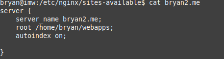
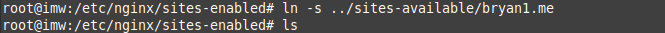
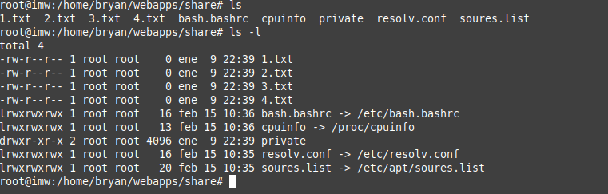
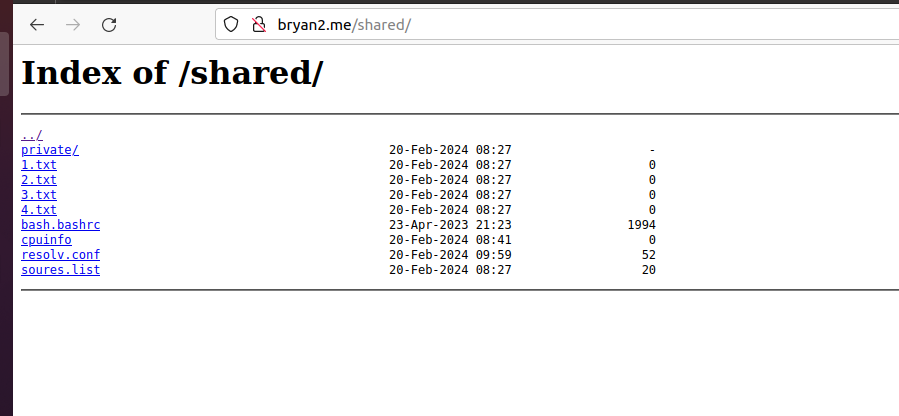

# Listado de directorios

***Nombre:*** Bryan Garcia Gallego
***Curso:*** 2º de Ciclo Superior de Administración de Sistemas Informáticos en Red.

### ÍNDICE

+ [Introducción](#id1)
+ [Objetivos](#id2)
+ [Material empleado](#id3)
+ [Desarrollo](#id4)
+ [Conclusiones](#id5)

#### ***Introducción***. 

La actividad consiste en permitir el acceso al contenido de un subdirectorio dentro de la ruta raíz de Nginx, enlazando una serie de ficheros desde ahí. Se debe realizar de dos formas en la máquina virtual y en docker.

#### ***Objetivos***. 

Realizaremos un host web nginx y mostraremos los archivos correspondientes con enlaces publicos.

#### ***Material empleado***. 

Maquina Debian con nginx instalado
Maquina ubuntu

#### ***Desarrollo***. 

Primero creamos el virtual host

Hacemos el enlace

 Y hacemos los enlaces con los archivos en la ruta de la pagina

Comprobamos

#### ***Conclusiones***. 

En conlusion aprendimos a enlazar archivos y tenerlos en otra carpeta sin necesidad de copiarlos.