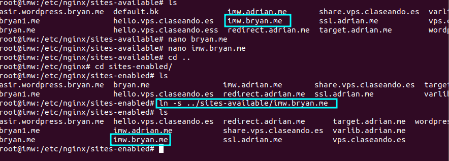
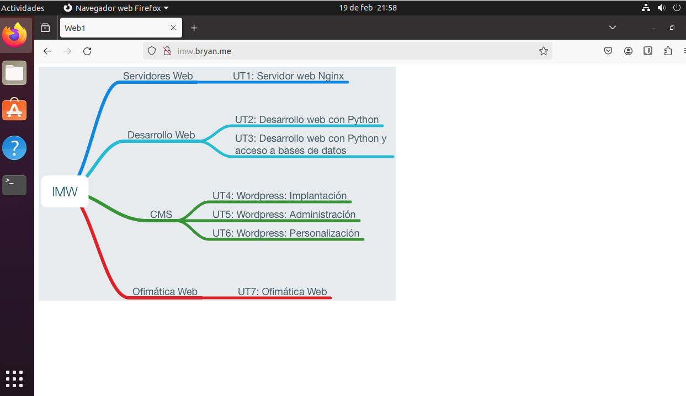
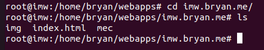
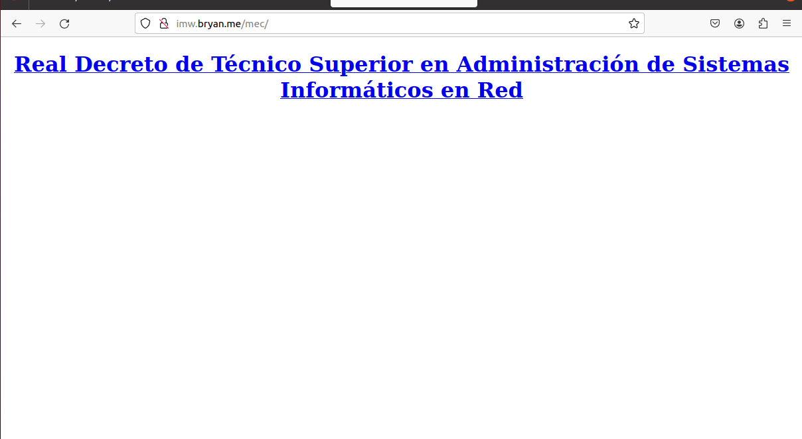
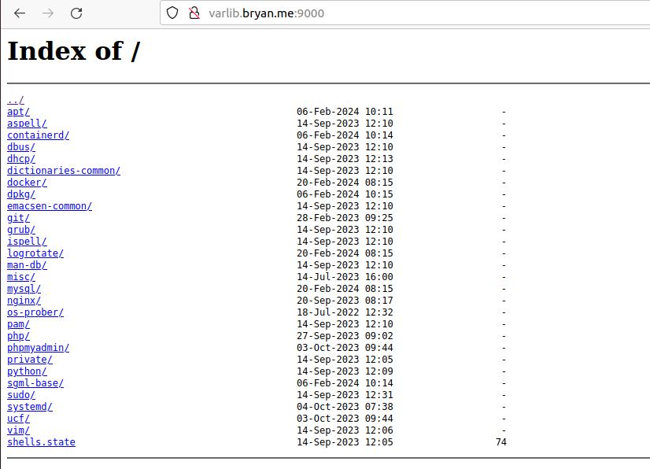

# Trabajo con virtual hosts

***Nombre:***
***Curso:*** 2º de Ciclo Superior de Administración de Sistemas Informáticos en Red.

### ÍNDICE

+ [Introducción](#id1)
+ [Objetivos](#id2)
+ [Material empleado](#id3)
+ [Desarrollo](#id4)
+ [Conclusiones](#id5)

#### ***Introducción***. 

La actividad consiste en configurar 4 sitios web (virtual hosts) en nuestro servidor web Nginx.

#### ***Objetivos***. 

Deberemos crear 4 paginas con 4 virtual host.

#### ***Material empleado***. 

Máquina de desarrollo debian con nginx instalado

#### ***Desarrollo***. 

hacemos los vinculos y los virtual host

Y asignamos la ruta 

#### ***Conclusiones***. 

En esta parte debemos exponer las conclusiones que sacamos del desarrollo de la prácica.