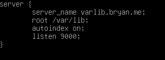
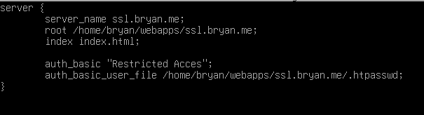
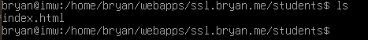
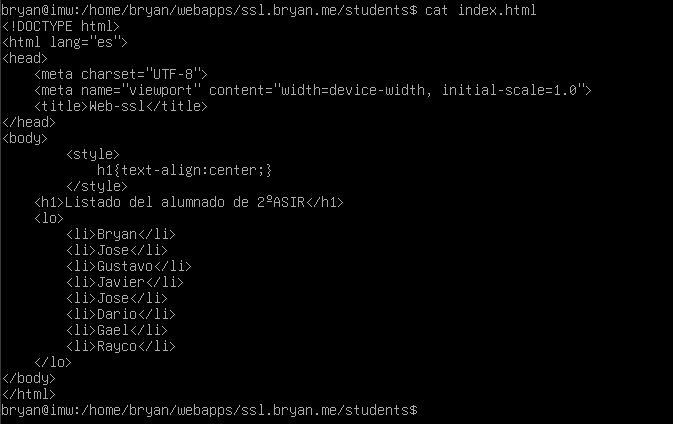
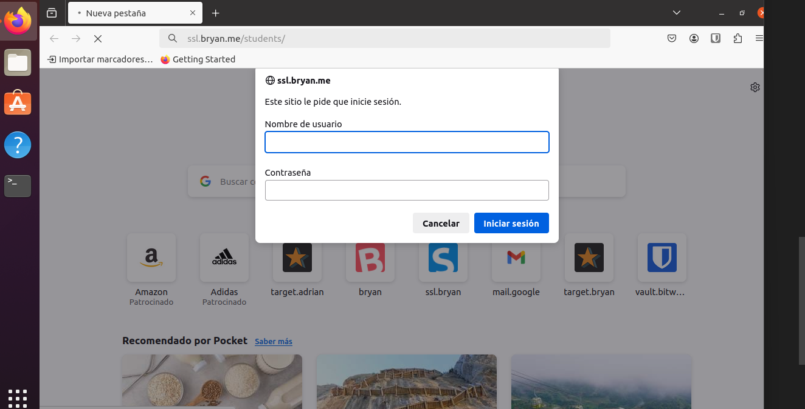
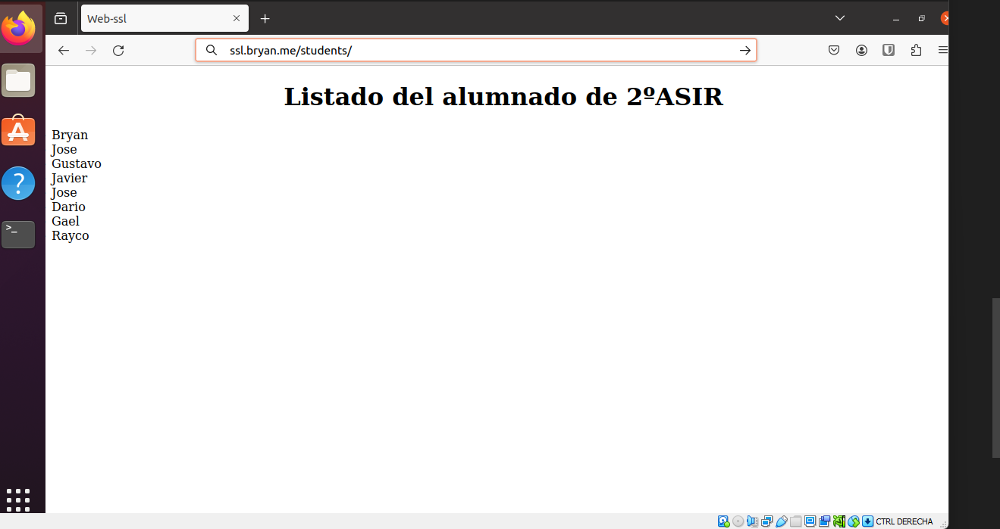
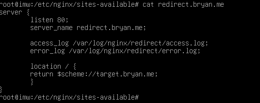
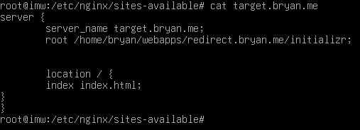
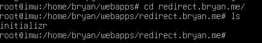
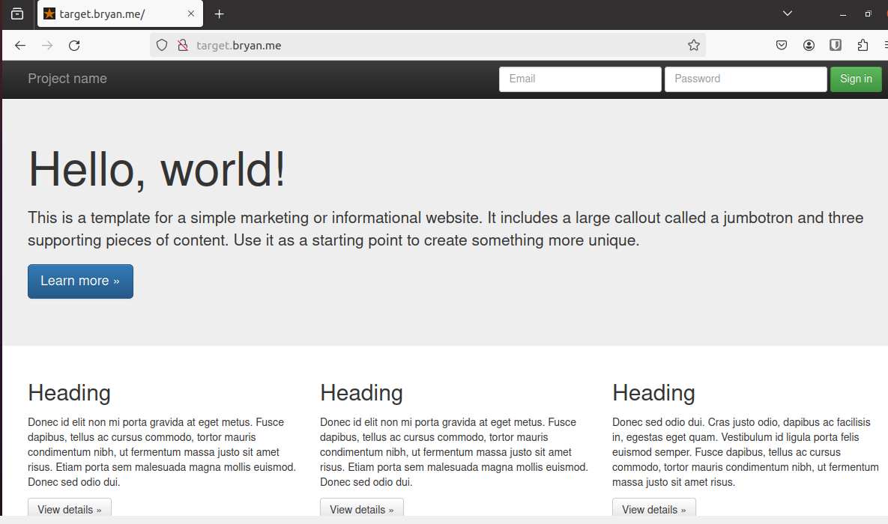

# Trabajo con virtual hosts

***Nombre:*** Bryan Garcia Gallego
***Curso:*** 2º de Ciclo Superior de Administración de Sistemas Informáticos en Red.

### ÍNDICE

+ [Introducción](#id1)
+ [Objetivos](#id2)
+ [Material empleado](#id3)
+ [Desarrollo](#id4)
+ [Conclusiones](#id5)

#### ***Introducción***. 

La actividad consiste en configurar 4 sitios web (virtual hosts) en nuestro servidor web Nginx.

#### ***Objetivos***. 

Deberemos crear 4 paginas con 4 virtual host.

#### ***Material empleado***. 

Máquina de desarrollo debian con nginx instalado

#### ***Desarrollo***. 

### Sitio Web1
hacemos los vinculos y los virtual host

Y asignamos la ruta 

Y comprobamos

Después hacemos la carpeta mec 

### Sitio web 2

Hacemos el mismo procedimiento creamos el virtual host y comprobamos en la maquina cliente y ponemos en escucha el puerto 9000

### Sitio web 3

Ahora haremos el virtual host de ssl.bryan.me y prohibimos el acceso al .htpasswd

Creamos el index con la lista de alumnos de 2asir

Comprobamos en la maquina cliente.

Como vemos nos pide el usuario y contraseña que establecimos

Ingresamos con el usuario1 y clave 2asir, y ya nos sale la pagina creada.

### Sitio web 4

creamos los virtual host respectivos

y descargamos el archivo initializr y lo descomprimimos en la carpeta que asignamos en el virtualhost para la ruta

Y comprobamos las entradas desde el navegador

#### ***Conclusiones***. 

En conclusion la practica nos ayuda a crear varios virtual host para nuestro propio servidor web y crear nuestra pagina de una manera eficiente.