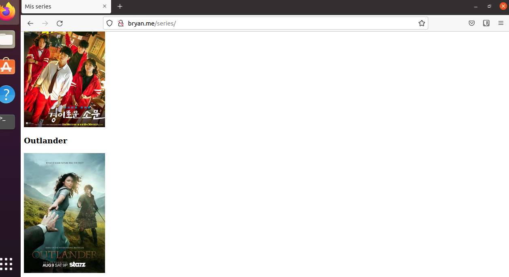

# Mis series favoritas

***Nombre:*** Bryan Garcia
***Curso:*** 2º de Ciclo Superior de Administración de Sistemas Informáticos en Red.

### ÍNDICE

+ [Introducción](#id1)
+ [Objetivos](#id2)
+ [Material empleado](#id3)
+ [Desarrollo](#id4)
+ [Conclusiones](#id5)

#### ***Introducción***. 

Realizaremos una pagina con un servidor nginx y docker

#### ***Objetivos***. 

 Crear una página web que nos enlace a tus 5 series favoritas. Realizaremos este proceso de dos formas: en la máquina de producción y en docker

#### ***Material empleado***. 
Maquina de produccion 

-Debian
-Docker instalado
-Nginx instalado

#### ***Desarrollo***. 

Primero verificaremos que esten instalado el docker y el nginx.

Luego crearemos nuestra pagina en html y la colocaremos en la ruta /var/www/html/series

colocamos en el fichero /etc/hosts la ip de la maquina servidor nginx para que pueda conectarse con  bryan/series/

#### ***Conclusiones***. 

En esta practia hemos aprendido a montar nuetro propio servidor web a la hora de subir sitios a la red.