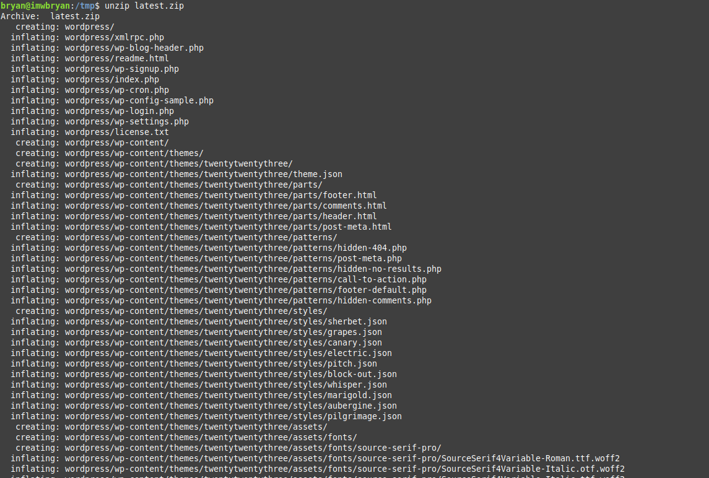
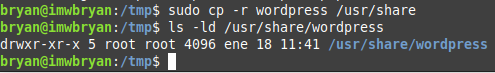

# TÍTULO DE LA PRÁCTICA

***Nombre:***
***Curso:*** 2º de Ciclo Superior de Administración de Sistemas Informáticos en Red.

### ÍNDICE

+ [Introducción](#id1)
+ [Objetivos](#id2)
+ [Material empleado](#id3)
+ [Desarrollo](#id4)
+ [Conclusiones](#id5)

#### ***Introducción***. 

En esta practica haremos una instalacion de wordpres en nuestra maquina de desarrollo debian con nginx.

#### ***Objetivos***. 

Instalar wordpres en nuestro servidor nginx

#### ***Material empleado***. 

* Máquina debian
* MariaDB-server
* Nginx
* Wordpress

#### ***Desarrollo***. 

Primero procederemos con la creación de la base de datos de wordpress con MariaDB

- Configuramos el usuario wpuser.
- Le damos todos los privilegios sobre la base de datos de wordpress.

Descargamos el archivo desde la pagina de wordpress con curl -0 https://wordpress.org/lastest.zip

Descomprimimos el zip descargado.

 despues de haberlo descomprimido lo copiamos en /usr/share

Ahora estableceremos los permisos necesarios para que el usuario web www-data pueda utilizar los ficheros

Editaremos los ficheros de configuracion de la y especificaremos los datos de la siguiente manera:

- El nombre de la base de datos.
- El usuario.
- La contraseña.

En donde dice " database_name_here " , lo sustisuimos por wordpress.bryan.me 

#### Acceso mediante Nginx

Crearemos un virtual host nuevo en la carptea sites-available de la siguiente manera.

~~~
sudo vi /etc/nginx/sites-available/wordpress.bryan.me
~~~~

Hacemos un reload al nginx y nos vamos al cliente

Importante cambiar el /etc/hosts de la maquina cliente con la ip de nuestro servidor y agregar el dominio para que pueda acceder desde el navegador.

Procedemos a acceder al navegador con wordpress.bryan.me

Escogemos idioma español y procedemos a crear el usuario por el cual accederemos.

Nos iremos a la parte de ajustes y seleccionaremos enlaces permanentes

Seleccionamos el ajuste Día y nombre. Pulsamos en Guardar cambios.

Ahora debemos indicar a Nginx que procese estas URLs:

Recargamos la configuracion de nginx nuevamente.

Por defecto, el límite de subida de archivos para aplicaciones PHP suele ser bastante bajo, en torno a los 2MB, lo incrementaremos de la siguiente manera en nuestra maquina debian.

" Importante, en el archivo 7.2 puede cambiar de nombre dependiendo de la version de php que tengamos instalada."
~~~
 sudo vi /etc/php/7.2/fpm/php.ini
~~~

Además debemos añadir esta linea en el fichero de configuración de Nginx:

Ahora crearemos un post de prueba en el wordpress.

#### ***Conclusiones***. 

En conclusion, esta practica nos ayuda a montar nuestro propio wordpress para realizar una pagina web de manera sencilla.

